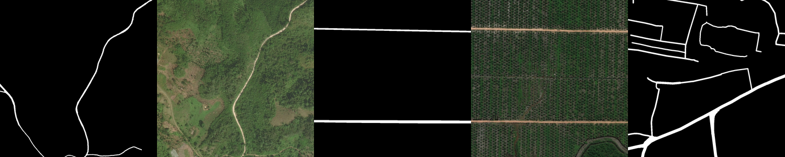
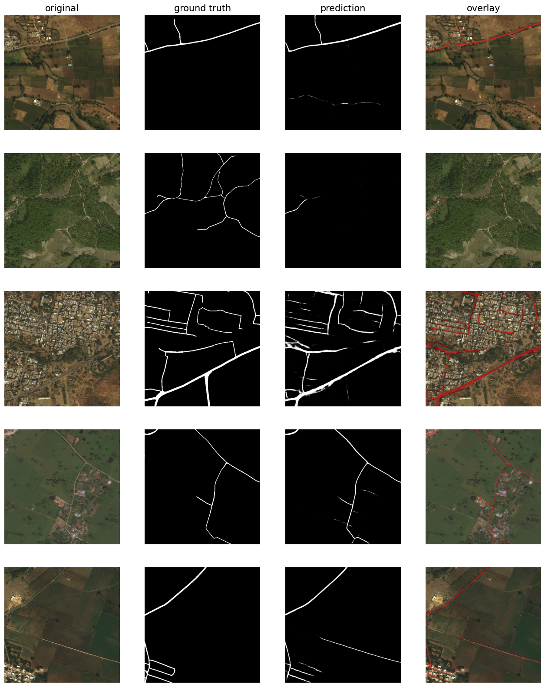

# Automatic road extraction from satellite images

##  Quick Links

> - [ Overview](#overview)
> - [ Features](#features)
> - [ Repository Structure](#repository-structure)
> - [ Modules](#modules)
> - [ Getting Started](#getting-started)
>   - [ Installation](#installation)
>   - [ Running analysis](#running-analysis)
> - [ Contributing](#contributing)
> - [ License](#license)
> - [ Acknowledgments](#acknowledgments)

---

##  Overview

In disaster zones, especially in developing countries, maps and accessibility information are crucial for crisis response. This dataset was obtained from Road Extraction Challenge Track in DeepGlobe Challenge (see publication below for more information on data source). As an initial step towards automated emergency response and expanded map connectivity, we present the challenge of using satellite imagery to automatically identify and extract road and street networks from remote locations.

[DeepGlobe 2018: A Challenge to Parse the Earth through Satellite Images.](https://arxiv.org/pdf/1805.06561) (2008) Demir, I., Koperski, K., Lindenbaum, D., Pang, G., Huang, J., Basu, S., Hughes, F., Tuia, D., & Raskar, R.

---

##  Repository Structure

```sh
deepglobe-road-segmentation
├── LICENSE
├── README.md
├── deep_globe_seg
│   └── helpers.py
├── environment.yml
├── logs
│   └── training_log.csv
├── notebooks
│   └── deep-globe-road-segmentation.ipynb
└── saved_models
    └── unet.weights.h5
```

---

##  Notebooks

###  `deep-globe-road-segmentation.ipynb`

This analysis provides a complete pipeline for training and evaluating a road extraction model from satellite imagery, which could be useful for various applications in urban planning, navigation, and geographic information systems. It uses deep learning to automatically detect and extract roads from satellite imagery. It employs a U-Net architecture with a ResNet50 backbone for image segmentation.

**Model Features:**

- Utilizes the segmentation_models library for implementing the U-Net model.
- Implements custom data loading and augmentation pipelines.
- Trains on a dataset of satellite images and corresponding road masks.
- Uses a combination of Dice loss and Focal loss for training.
- Evaluates the model using IoU (Intersection over Union) and F1 score metrics.


**Workflow:**

- Loads and preprocesses the dataset, splitting it into train, validation, and test sets.
- Applies data augmentation to the training set.
- Trains the U-Net model with early stopping and learning rate reduction.
- Evaluates the model's performance on training, validation, and test sets.
- Visualizes the original images, ground truth masks, and model predictions.

**Results:**

- The model achieves an IoU of over 0.5. A sample of predictions is shown below, for illustrative purposes.



---

##  Getting Started

###  Requirements

Ensure you have conda installed on your system before creating the environment. You can refer to the official conda documentation for [installation instructions](https://conda.io/projects/conda/en/latest/user-guide/install/).

Ensure you have the following dependencies installed on your system:

- **Python**: `3.9`
- **JupyterNotebook**: `version v7.1.3 `

###  Installation

1. Clone the deepglobe-road-segmentation repository:

```sh
git clone git@github.com:sg-peytrignet/deepglobe-road-segmentation.git
```

2. Change to the project directory:

```sh
cd deepglobe-road-segmentation
```

3. Install the dependencies with conda:

```sh
conda env create -f environment.yml
conda activate road_extraction_env
```

###  Running analysis

Run each notebook in the IDE of your choice, such as JupyterLab or Visual Studio. You may launch Jupyter from the terminal:

```sh
jupyter notebook
```

In the Jupyter interface that opens in your web browser, click on the `.ipynb` file to open it. You can now run cells, modify code, and interact with the notebook.

---

##  License

This project is protected under the [MIT](LICENSE) License.

---

##  Acknowledgments

- Thanks to @[qubvel](https://github.com/qubvel) and their [segmentation-models](https://github.com/qubvel/segmentation_models) Python package, including the example notebooks provided as part of the package.

[**Return**](#quick-links)